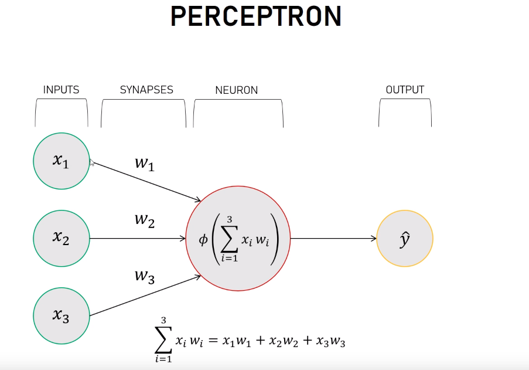
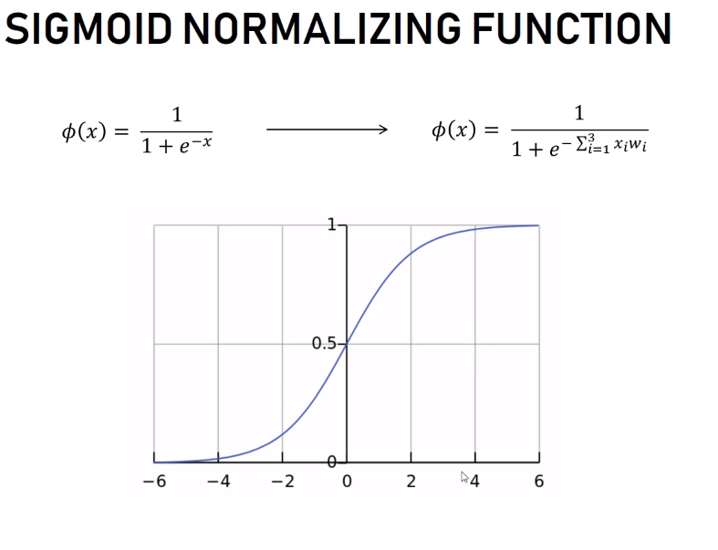

# Simple Neural Network
Creating a simple neural network in Python with one input layer (3 inputs) and one output neuron. A neural network with no hidden layers is called a perceptron. 
Thanks to Jonas Bostoen
## What does it do?
The neural_net.py tries to predict the output given 3 binary inputs. If the first input is 1, the output should be one. Otherwise the output should be 0.

